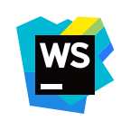

<h1 align="center">Hi, I'm Van.</h1>

## I'm a Backend Developer and Student
- 💪 I like to write code
- 📷 I love taking pictures
- 🥅 I am constantly learning new things

### Connect with me:

### Languages:

 

 

 

### Tools:

 
 
 
 
<a href="https://www.jetbrains.com/webstorm/" target="_blank" rel="noreferrer"> 
 

